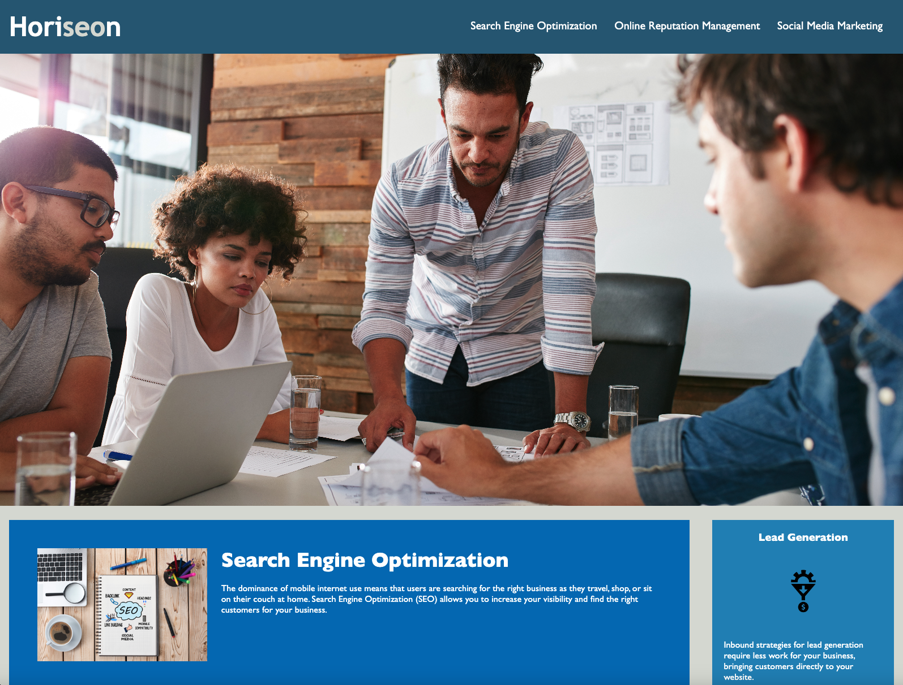

# Horiseon - SEO & Brand Management Optimization

## Description

This replicates a marketing page for a marketing landing page. I have refactored both the HTML and CSS to improve SEO visibility and accessbility features. Including semantic tags, by adding an h1, a main, and a footer to meet Google Standards. Adding alt tags to images for accessibility readers.

[Deployed App](https://chadkraus87.github.io/CodeRefactor/)

## Installation

No installation necessary for this application. If you would like to use this code, you may clone down the repo.

## Usage

This highlights how to create a marketing page with SEO and accessiblity standards.

## Credits

[HTML Semantic Elements](https://www.w3schools.com/html/html5_semantic_elements.asp)

[CSS Selector](https://developer.mozilla.org/en-US/docs/Glossary/CSS_Selector)

[CSS Layout - The Position Property](https://www.w3schools.com/css/css_positioning.asp)

[Professional README Guide](https://coding-boot-camp.github.io/full-stack/github/professional-readme-guide)

## License

MIT License

A short and simple permissive license with conditions only requiring preservation of copyright and license notices. Licensed works, modifications, and larger works may be distributed under different terms and without source code.